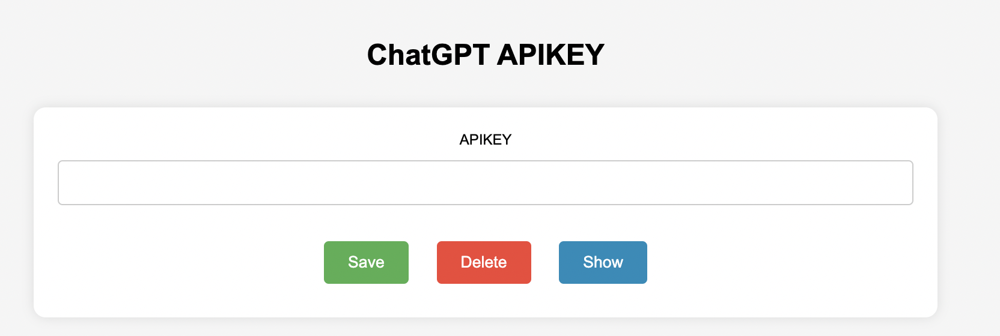
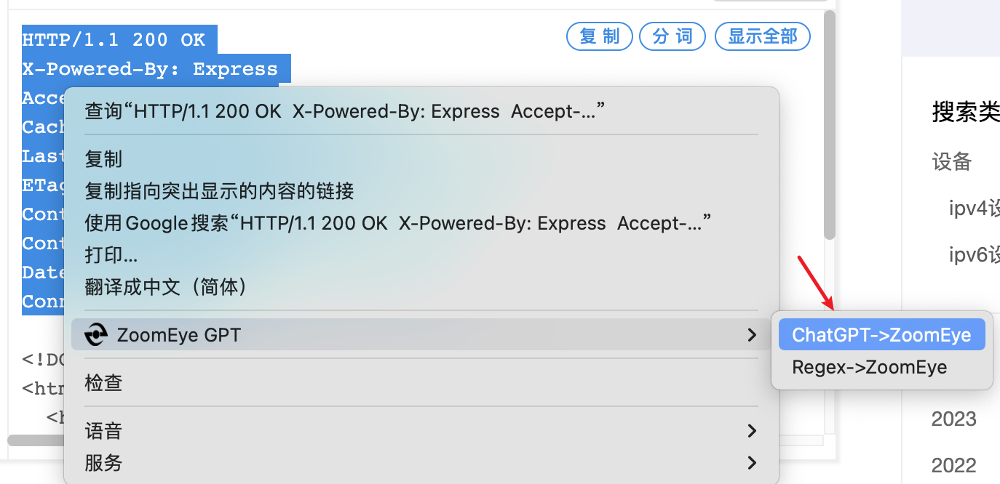
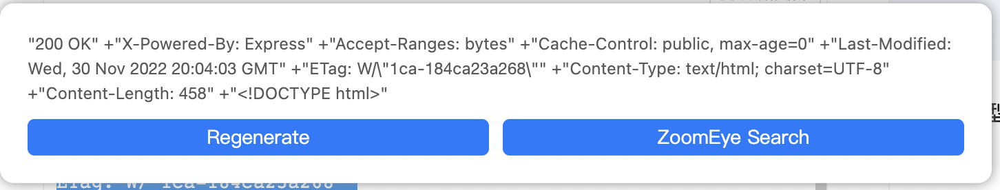
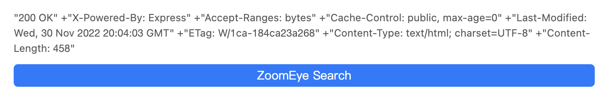
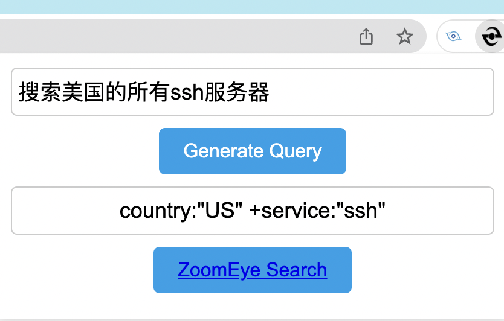

# ZoomEye GPT

[English](./README_EN.md)

## 介绍

ZoomEye GPT浏览器插件是一款基于GPT的Chrome浏览器扩展程序，旨在为ZoomEye的用户带来AI辅助搜索的体验。该插件可以自动生成批量查询ZoomEye语法，非常适合行为测绘，除此之外，对于不了解ZoomEye搜索语法的用户，也可以通过该插件的语法转换功能，把自然语言转换成ZoomEye搜索语法。这些功能将大大提升用户在Zoomeye上的搜索效率和准确度，使用户能够更快地找到所需信息。

## 安装

ZoomEye GPT插件以发布到chrome插件商店，可通过chrome插件商店直接安装

## 配置

第一次使用时，需要设置ChatGPT 的 APIKEY，如果没有ChatGPT的APIKEY，可以到这里申请。

https://platform.openai.com/account/api-keys

右键点击ZoomEye GPT，找到"选项"

需要确保ChatGPT的APIKEY没有过期并且额度足够，否则无法使用ChatGPT的API。

## 功能

### 自动生成批量查询dork

选中一段内容，右键找到`ChatGPT -> ZoomEye`，即可对响应体中的关键字进行提取，并生成ZoomEye搜索使用的语法。

结果

在无法使用ChatGPT的情况下，可以用`Regex->Zoomeye`来提取响应。

### 语法转换

利用GPT把自然语言转换成ZoomEye的搜索语法

比如：

搜索美国的所有ssh服务器

通过点击ZoomEye Search链接，就可以跳转到ZoomEye的搜索结果页面。

