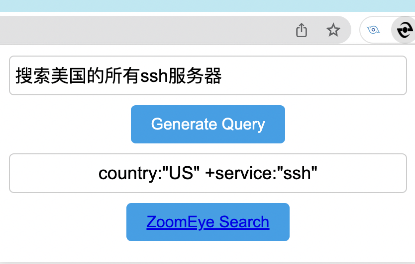

# ZoomEye GPT

[中文](./README.md)

## config
When using it for the first time, you need to set the APIKEY of ChatGPT, right click on ZoomEye GPT and find "Options"

## Use

### Auto generate dork

Select a piece of content, right-click to find `ChatGPT -> ZoomEye`, you can extract the keywords in the response body, and generate the grammar used by ZoomEye search

result

Without using ChatGPT, you can use `Regex->Zoomeye` to extract the response.

### syntax transformation
Use GPT to convert input into ZoomEye's search syntax

For example:
Search all ssh servers in the US

